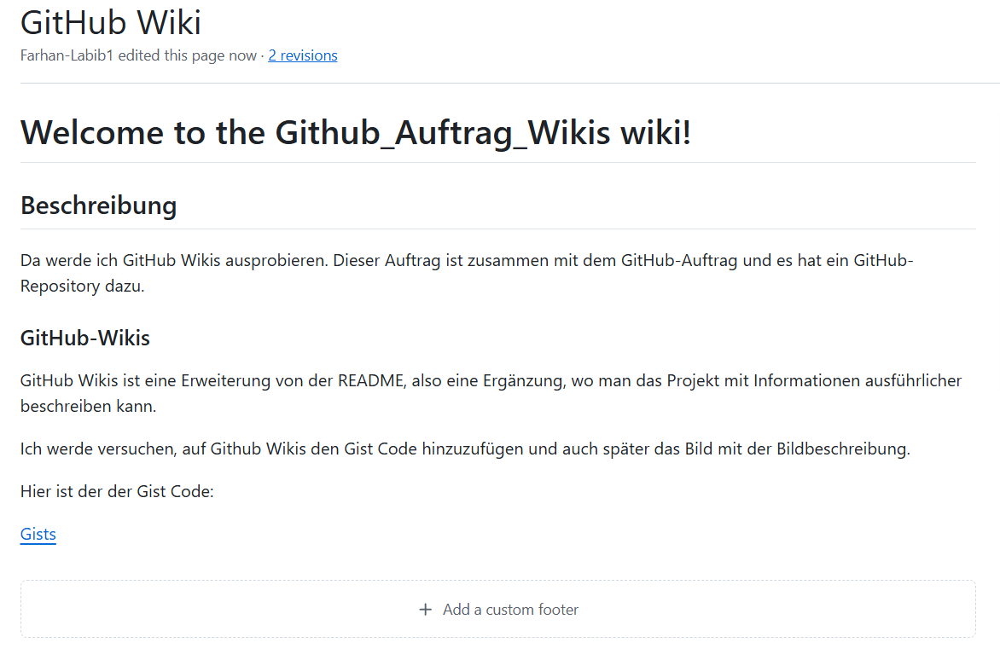

# GitHub Auftrag Wikis

## Beschreibung

Da werde ich GitHub Wikis ausprobieren. Dieses Auftrag ist zusammen mit der GitHub Auftraegen und es hat eine GitHub Repository dazu.

 

### GitHub Wikis 

GitHub Wikis ist eine Erweiterung von der README, also ein Zusatz, wo man das Projekt mit Informationen ausführlicher beschreiben kann.

Ich werde versuchen auf Github Wikis das Gist Code zu hinzuzufügen und auch später das Bild mit der Bildbeschreibung. 

